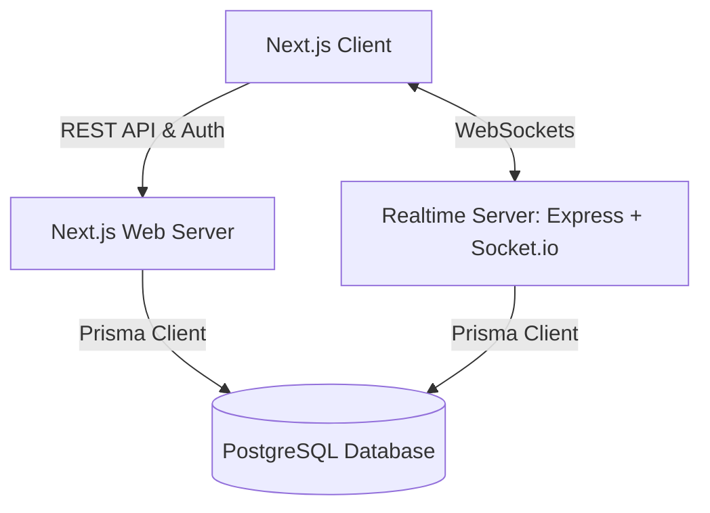

# Bidstand ⚡ — Realtime Auction Room (11auction Assignment)

Bidstand is a high-performance, realtime auction platform designed to fulfill the **Mini Realtime Auction Room** requirement. It is built for live franchise-style player auctions (similar to IPL/cricket-franchise drafts) where users can join a room, an admin starts the auction, and one item is presented at a time while participants bid live against a synchronized countdown timer. 

The system separates client interface logic, transactional storage, and realtime socket event handling to ensure absolute state authority and sub-millisecond coordination, satisfying the core evaluation criteria for realtime correctness and concurrent usage.

## Live Demo

- **Web App (Vercel):** [https://11-auction-web.vercel.app/](https://11-auction-web.vercel.app/) 
- **Realtime Server (Hugging Face Spaces):** [https://huggingface.co/spaces/Xombi17/bidstand-realtime](https://huggingface.co/spaces/Xombi17/bidstand-realtime)

## Demo Credentials

Bidstand is designed to be experienced without any hard paywalls or complicated sign-ups to test the core features:
1. **Commissioner (Host):** Sign in or create a room anonymously. You will receive a 6-character room code.
2. **Team Owner (Participant):** Open an incognito window, click "Join Room", and enter the 6-character code. You will be assigned to a team and can bid live.
3. **Spectator:** Join the room using the same code, but choose a view-only mode to watch the auction unfold.

## Tech Stack

| Layer | Technology | Rationale |
| :--- | :--- | :--- |
| **Frontend UI** | Next.js 14 (App Router) + TypeScript | Hybrid static/server rendering, optimized pages, and unified routing. |
| **Styling & Design** | Tailwind CSS + shadcn/ui | Tailored, modern design system with sleek, responsive components. |
| **Realtime Engine** | Node.js + Express + Socket.io | Standalone, state-authoritative websocket server for immediate updates. |
| **Database ORM** | Prisma | Strict type safety shared across both the web app and realtime server. |
| **Database** | PostgreSQL | Robust transactional guarantees for persistent room and bidding records. |
| **Contracts & Validation** | Zod | Runtime payload validation for all API endpoints and socket events. |

## Features

- **Authoritative Server Timer:** The server owns the exact countdown (`timerEndsAt` epoch timestamp). Clients calculate remaining time locally to mitigate network latency and prevent drift.
- **Dynamic Bidding Rules:** Enforces bid increments, validation of team purses, current item status, and handles concurrent bids sequentially.
- **Role-based Rooms:**
  - **Commissioner:** Controls room states (Start, Pause, Resume, force-resolve).
  - **Team Owner:** Can place live bids on active items, bound by team budget (purse).
  - **Spectator:** Realtime view-only access to bid flows and team statistics.
- **Presence Tracking:** See who is currently active and connected to the auction room in real time.
- **Docker Support:** Ready-to-deploy Dockerfile configuration for production deployments of the realtime service.

## Architecture

Bidstand is organized as a monorepo containing distinct packages for the database, frontend web application, realtime coordination server, and shared schemas/types.



## Realtime Design

Realtime correctness is the absolute priority of Bidstand. 
- **Server Authority:** The frontend never decides an auction outcome or trusts client-submitted timer expiries. The Node.js realtime server maintains the absolute truth.
- **Concurrent Bids:** Bids are validated sequentially against the current high bid and team's remaining purse to prevent race conditions where two users bid simultaneously.
- **Timer Sync:** Instead of emitting a tick every second (which overloads websockets and introduces jitter), the server emits an absolute `timerEndsAt` timestamp. The clients compute the difference locally for a perfectly smooth UI.

## Database Schema

Bidstand uses PostgreSQL with Prisma as the ORM. The core models include:
- **User:** Represents registered platform users (typically Commissioners).
- **Room:** Represents an auction lobby, holding rules like purse limits and the current active item.
- **Team:** A franchise participating in the room, holding a budget (purse).
- **Item (Player):** The entity being auctioned, which transitions from `PENDING` -> `IN_AUCTION` -> `SOLD`/`UNSOLD`.
- **Bid:** An immutable ledger of placed bids.
- **Participant:** Represents the active socket sessions mapped to users or anonymous browsers.

See `docs/DATABASE_SCHEMA.md` for the exact Prisma implementation.

## AI Usage

AI tools (Codex, Claude Code / Gemini) were used heavily to structure the initial monorepo architecture, build the boilerplate for Next.js and Socket.io, and assist in debugging deployment configurations. 

All prompts, raw session transcripts, and a detailed summary of manual decisions vs AI-generated code are located in the `ai-transcripts/` folder.
- See `ai-transcripts/ai-usage-summary.md` for a comprehensive breakdown.

## Running Locally

### 1. Install Dependencies
```bash
pnpm install
```

### 2. Configure Environment Variables
Copy `.env.example` to `.env` in the root, `apps/web`, and `apps/realtime`:
```bash
cp .env.example apps/web/.env
cp .env.example apps/realtime/.env
```
*(Ensure `ROOM_JWT_SECRET` is identical in both environments).*

### 3. Run Database Migrations
Configure your PostgreSQL connection string in `.env`, then migrate:
```bash
pnpm --filter @bidstand/db db:migrate
```

### 4. Run Development Servers
* **Next.js Web Server:** `pnpm dev:web` (http://localhost:3000)
* **Socket.io Realtime Server:** `pnpm dev:realtime` (http://localhost:4000)

## Environment Variables

Refer to `.env.example` in the repository root. Key variables include:
- `DATABASE_URL`: Connection string to your PostgreSQL instance.
- `NEXTAUTH_SECRET`: Secret for NextAuth session signing.
- `NEXT_PUBLIC_REALTIME_URL`: The URL of the deployed Socket.io server.
- `ROOM_JWT_SECRET`: A shared secret between the Next.js API and the Realtime server to securely mint and verify room access tokens.

## Known Limitations

- **Vercel Statelessness:** Because Vercel uses serverless edge functions, the WebSocket server must be hosted separately (e.g., Render, Railway, Hugging Face). It cannot be deployed together with the Next.js frontend on Vercel.
- **Mobile Responsiveness:** The UI is currently optimized primarily for Desktop screens, as the primary objective of this phase was functional correctness and realtime stability.

## Future Improvements

- Add a robust test suite covering edge cases in the live bidding state machine.
- Implement spectator live chat and emoji reactions during the auction.
- Enhance the mobile view for Team Owners to bid from their phones.
- Support importing items/players via CSV uploads for Commissioners.
