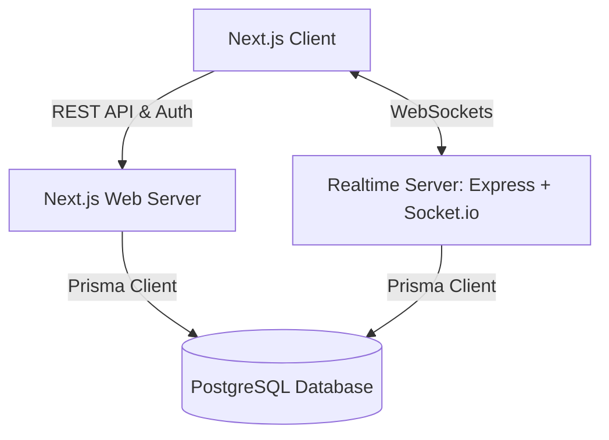

# Bidstand ⚡ — Realtime Auction Room

Bidstand is a high-performance, realtime auction platform designed for live franchise-style player auctions (similar to IPL/cricket-franchise drafts). The system separates client interface logic, transactional storage, and realtime socket event handling to ensure absolute state authority and sub-millisecond coordination.

---

## 🏗️ System Architecture & Tech Stack

Bidstand is organized as a monorepo containing distinct packages for the database, frontend web application, realtime coordination server, and shared schemas/types.

| Layer | Technology | Rationale |
| :--- | :--- | :--- |
| **Frontend UI** | Next.js 14 (App Router) + TypeScript | Hybrid static/server rendering, optimized pages, and unified routing. |
| **Styling & Design** | Tailwind CSS + shadcn/ui | Tailored, modern design system with sleek, responsive components. |
| **Realtime Engine** | Node.js + Express + Socket.io | Standalone, state-authoritative websocket server for immediate updates. |
| **Database ORM** | Prisma | Strict type safety shared across both the web app and realtime server. |
| **Database** | PostgreSQL | Robust transactional guarantees for persistent room and bidding records. |
| **Contracts & Validation** | Zod | Runtime payload validation for all API endpoints and socket events. |



---

## ✨ Features

- **Authoritative Server Timer:** The server owns the exact countdown (`timerEndsAt` epoch timestamp). Clients calculate remaining time locally to mitigate network latency and prevent drift.
- **Dynamic Bidding Rules:** Enforces bid increments, validation of team purses, current item status, and handles concurrent bids sequentially.
- **Role-based Rooms:**
  - **Commissioner:** Controls room states (Start, Pause, Resume, force-resolve).
  - **Team Owner:** Can place live bids on active items, bound by team budget (purse).
  - **Spectator:** Realtime view-only access to bid flows and team statistics.
- **Presence Tracking:** See who is currently active and connected to the auction room in real time.
- **Docker Support:** Ready-to-deploy Dockerfile configuration for production deployments of the realtime service.

---

## 📂 Repository Structure

```
├── apps/
│   ├── web/                 # Next.js - Web app, REST APIs, and authentication
│   └── realtime/            # Express + Socket.io - Authoritative auction room & timer state
├── packages/
│   ├── db/                  # Shared database schema & generated Prisma Client
│   └── shared/              # Shared types, Zod validation contracts, and event definitions
├── docs/                    # Detailed technical specifications and manuals
└── Dockerfile               # Production container configuration for the realtime service
```

---

## 🚀 Setup & Running Locally

### 1. Install Dependencies
Ensure you have `pnpm` installed, then run:
```bash
pnpm install
```

### 2. Configure Environment Variables
Copy `.env.example` to `.env` in both `apps/web` and `apps/realtime`:
```bash
cp apps/web/.env.example apps/web/.env
cp apps/realtime/.env.example apps/realtime/.env
```
> [!IMPORTANT]
> The `ROOM_JWT_SECRET` must be identical in both `.env` files to successfully share and verify authenticated sessions between the web app and the realtime server.

### 3. Run Database Migrations
Configure your PostgreSQL connection string (`DATABASE_URL`) in the `.env` files, then migrate the database:
```bash
pnpm db:migrate
# Or directly: pnpm --filter @bidstand/db db:migrate
```

### 4. Run Development Servers
Start the services:
* **Next.js Web Server** (`http://localhost:3000`):
  ```bash
  pnpm dev:web
  ```
* **Socket.io Realtime Server** (`http://localhost:4000`):
  ```bash
  pnpm dev:realtime
  ```

---

## 🧪 Quality and Testing

Keep the codebase clean, typed, and well-tested by running checks regularly:

- **Typecheck the entire workspace:**
  ```bash
  pnpm typecheck
  ```
- **Lint components and libraries:**
  ```bash
  pnpm lint
  ```

---

## 🌐 Deployment

For complete details, check out the [Deployment Guide](file:///home/varad/Documents/internship-tasks/11-auction-Auction-Task/docs/DEPLOYMENT.md).

- **Web Application:** Deploys natively on **Vercel**.
- **Realtime Server:** Requires a persistent server hosting option like **Render** or **Railway** because websocket connections cannot run on Vercel's serverless functions.
