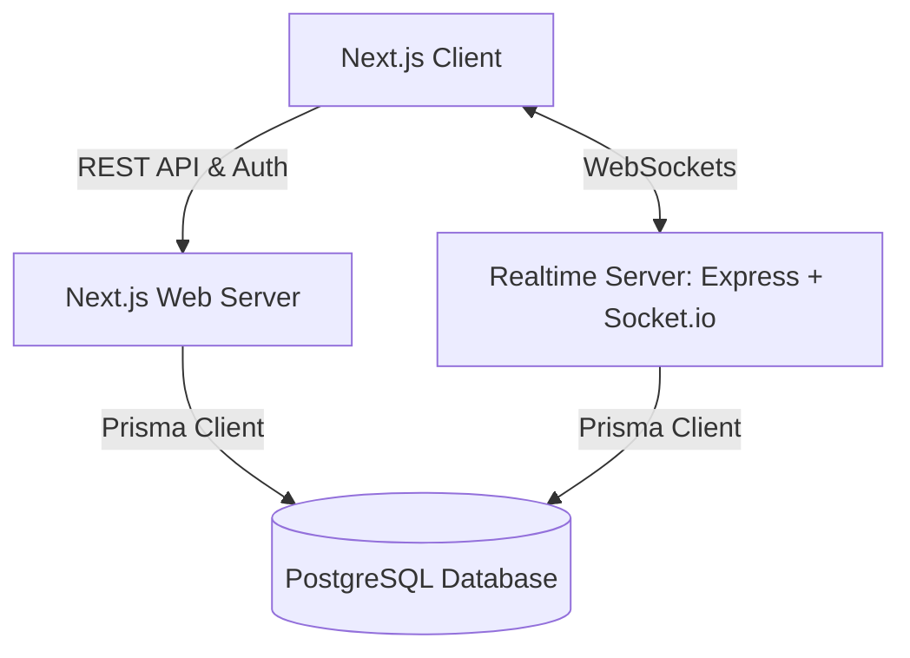

# Bidstand ⚡ — Realtime Auction Room (11auction Assignment)

Bidstand is a realtime auction platform built for the **Mini Realtime Auction Room** assignment option. It recreates a live franchise-style player auction (IPL/cricket-draft style): users join a room, an admin runs the auction one item at a time, participants bid against a synchronized countdown timer, and every item resolves to **SOLD** or **UNSOLD** before a final results page.

The system splits client UI, transactional storage, and realtime socket coordination into separate concerns so the auction's state has one source of truth — the realtime server — which is what the assignment's realtime-correctness criteria actually grades.

---

## Live Demo

- **Web App (Vercel):** [https://11-auction-web.vercel.app/](https://11-auction-web.vercel.app/)
- **Realtime Server (Hugging Face Spaces):** [https://huggingface.co/spaces/Xombi17/bidstand-realtime](https://huggingface.co/spaces/Xombi17/bidstand-realtime)

## Demo Credentials

No paywalls or signup friction to evaluate the core flow:

1. **Commissioner (Host):** Sign in or create a room anonymously. You'll get a 6-character room code.
2. **Team Owner (Participant):** Open an incognito window, click "Join Room," enter the code. You're assigned a team and can bid live.
3. **Spectator:** Join with the same code, choose view-only mode to watch the auction unfold.

## Tech Stack

| Layer | Technology | Rationale |
| :--- | :--- | :--- |
| **Frontend UI** | Next.js 14 (App Router) + TypeScript | Hybrid static/server rendering, optimized pages, unified routing |
| **Styling & Design** | Tailwind CSS + shadcn/ui | Modern design system, sleek responsive components |
| **Realtime Engine** | Node.js + Express + Socket.io | Standalone, state-authoritative websocket server, deployed independently from the frontend |
| **Database ORM** | Prisma | Shared, strictly-typed schema across the web app and realtime server |
| **Database** | PostgreSQL | Transactional guarantees for persistent room and bid records |
| **Contracts & Validation** | Zod | Runtime payload validation on every API endpoint and socket event |

## Features

- **Authoritative Server Timer** — the server owns the exact countdown via a `timerEndsAt` epoch timestamp; clients compute remaining time locally so network latency never desyncs the UI.
- **Dynamic Bidding Rules** — enforces bid increments, team purse limits, item status, and serializes concurrent bids instead of racing them.
- **Role-Based Rooms:**
  - **Commissioner** — controls room state (Start, Pause, Resume, force-resolve)
  - **Team Owner** — places live bids, bound by team budget
  - **Spectator** — realtime view-only access to bids and team stats
- **Presence Tracking** — see who's connected to the room in real time.
- **Docker Support** — ready-to-deploy Dockerfile for the realtime service.

## Architecture

Bidstand is a monorepo with separate packages for the database, web app, realtime server, and shared types.



## Realtime Design

Realtime correctness was treated as the project's single hardest requirement, not a feature to bolt on at the end.

- **Server Authority** — the frontend never decides an outcome or trusts a client-submitted timer expiry. The Node.js realtime server is the absolute source of truth.
- **Concurrent Bids** — bids are validated sequentially against the current high bid and the bidding team's remaining purse, so two simultaneous bids can't both win.
- **Timer Sync** — instead of ticking every second over the socket (which adds jitter and load), the server emits one absolute `timerEndsAt` timestamp. Clients compute the countdown locally for a smooth UI with no drift.

## Database Schema

PostgreSQL via Prisma. Core models:

- **User** — registered platform users (typically Commissioners)
- **Room** — an auction lobby: purse rules, current active item
- **Team** — a franchise in the room, holding a budget (purse)
- **Item (Player)** — the auctioned entity: `PENDING` → `IN_AUCTION` → `SOLD`/`UNSOLD`
- **Bid** — an immutable ledger of placed bids
- **Participant** — active socket sessions mapped to users or anonymous browsers

Full Prisma schema: `docs/DATABASE_SCHEMA.md`

---

## How This Was Built

The brief is explicit that it's grading *how well you directed AI*, not whether you avoided it. So here's the actual build sequence, tool by tool, rather than a single vague "AI was used" line.

### Phase 0 — Planning & Architecture (Claude)

Before any code, the project went through a planning pass with Claude using the **GSD (Get Shit Done)** methodology to break the build into atomic, ordered phases instead of improvising structure mid-build.

- Evaluated all four assignment options (AI Memory Journal, Mini AI Design Mode, Auction Room, Watch Together) against the brief's own evaluation criteria, and picked the **Auction Room** for domain fit and because it leaned on prior realtime-systems experience rather than starting cold.
- Drafted **`PRD.md`** — auction state machine (`LOBBY → AUCTION → COMPLETED`), user flows, functional requirements, tech stack rationale, data model summary, and stated assumptions.
- Drafted **`ARCHITECTURE.md`** — system diagram, in-memory auction engine design, the Prisma schema, the full Socket.io event contract table, the timer-sync strategy (absolute epoch timestamps with clock-offset correction), auth design, reconnection/resync strategy, deployment plan, and security notes.
- Settled the one architectural decision everything downstream depended on: **Vercel's serverless functions can't hold a persistent WebSocket connection**, which directly conflicts with "realtime is central" in the brief. Resolution: keep Next.js on Vercel for the frontend (it's a great fit for that), but run the Socket.io realtime server as a **separate, always-on service** (Hugging Face Spaces) rather than trying to force everything onto one host.

These two documents (`PRD.md`, `ARCHITECTURE.md`) became the seed input for the coding-agent phases below — every agent was pointed at them instead of re-explaining the system from scratch each session.

### Phase 1 — Scaffolding (OpenCode)

OpenCode scaffolded the entire monorepo from scratch — the pnpm workspace (`pnpm-workspace.yaml`, `package.json`, `tsconfig.base.json`), the `apps/web` (Next.js 14 App Router) and `apps/realtime` (Express + Socket.io) directory structures, the `packages/db` (Prisma schema + client) and `packages/shared` (Zod schemas + types) packages. It generated the initial Prisma schema from the `ARCHITECTURE.md` spec, set up the Express/Socket.io bootstrap with JWT auth middleware, created the Next.js App Router layout + landing page shell, and wired up the shared TypeScript strict configuration across all packages.

OpenCode is a terminal-first, open-source coding agent — used here for the structural groundwork because it runs directly against the repo with full file/shell access, which suits scaffolding work better than a chat-based tool.

### Phase 2 — Core Feature Build (Antigravity/Gemini)

Antigravity (powered by Gemini) built the auction core across two sub-phases. Phase 2a delivered: the live bidding state machine (`apps/realtime/src/rooms/auction.ts`) with full validation (purse limits, bid increments via `getIncrementForPrice`, squad caps, role caps), the server-authoritative countdown timer (`rooms/timer.ts`) using absolute epoch timestamps, Socket.io event handlers for `room:start/pause/resume/force-resolve` and `bid:place`, the presence-tracking lobby system, and the commissioner dashboard, room creation wizard, join room flow, and lobby UI on the frontend. Phase 2b added: the `/api/rooms/[code]/results` API endpoint, the detailed results page with team standings and unsold players (with fallback polling for spectators without socket tokens), komal/sold/unsold resolution overlays, and procedural audio cues via the Web Audio API.

Google's Antigravity is an agent-first IDE built around planning and verifying multi-step tasks (not just autocomplete) — used here for the larger, interdependent feature work where having the agent produce a plan and walkthrough before touching code mattered more than raw speed.

### Phase 3 — Results & Polish (Antigravity/Gemini)

Phase 3 added the post-auction results view: the `/room/[code]/results` page showing team standings with purchased players and remaining purses, an unsold players section, and the results API endpoint (`/api/rooms/[code]/results`). It also wired up the demo room creator (pre-populated IPL-style teams/players at `/api/demo/room`), added procedural audio via Web Audio API, and polished the auction-room UI — keyboard shortcuts (Space = bid, P = pause/resume, Esc = close), SOLD/UNSOLD resolution overlays, and a disconnection banner.

The deployment iteration commits (Prisma engine fix for Vercel `cd2cd96`, build pipeline adjustment `564d75d`, Docker config for Hugging Face Spaces `6c613f4`, `.env.example` standardization `2d8eb93`, and JWT auth with HTTP-only cookies `1750b61`) were done manually — platform-specific quirks are faster to fix directly than to describe to an AI. The `participant:kick` event and the socket-communication service-module refactor were also applied in this iteration.

### Design Choices & Rationale

| Decision | Why |
| :--- | :--- |
| Per-room async mutex for bid serialization | Guarantees correct outcomes when two users bid on the same item at the same instant on a single Node.js process |
| Write-then-broadcast on every state transition | Never broadcasts a result that then fails to persist — DB write succeeds first, socket emit second |
| Absolute epoch timestamp for the timer, not per-second ticks | Removes jitter/drift and cuts socket traffic; client does the countdown math locally |
| Realtime server deployed separately from the Next.js frontend | Vercel's serverless model cannot hold a persistent WebSocket connection — non-negotiable given the brief's realtime requirement |
| Shared Prisma schema across web + realtime packages | One schema, one source of type truth, no drift between the two services |

---

## AI Usage

| Tool | Role in the build | Used for |
| :--- | :--- | :--- |
| **Claude** | Planning & architecture | PRD, system architecture, GSD-structured roadmap, design-decision drafting |
| **OpenCode** | Scaffolding | Monorepo setup, Prisma schema, Express/Socket.io bootstrap, Next.js App Router shell, shared Zod schemas |
| **Google Antigravity (Gemini)** | Core feature implementation | Live bidding state machine, countdown timer, Socket.io event handlers, lobby/presence, commissioner dashboard, room creation/join flows, results page, demo room, SOLD/UNSOLD overlays, audio cues |
| **Kimchi (minimax-m3)** | Bookkeeping & light fixes | Transcript capture, summary refresh |

**Manual decisions made independent of AI suggestions:**
- Chose to split the realtime server into its own deployment rather than accept any AI-suggested all-in-one Vercel setup.
- Replaced NextAuth with custom signed JWT tokens for faster integration and robustness across localhost ports.
- Added fallback polling (every 3s) to the results page for spectators without socket tokens.
- Configured `packages/db` to run `prisma generate` dynamically inside Vercel's build pipeline.
- Downgraded Node.js from 22 to 20 in Dockerfile to match Hugging Face Spaces runtime.
- Added `binaryTargets` to Prisma schema to fix Vercel deployment query engine errors.
- Deployment-iteration fixes (Docker config, build pipeline, `.env.example`, JWT cookie auth) were applied directly — faster than describing each platform quirk to an AI tool.

**Known limitations of the AI-assisted process:**
- Prisma Client generation in monorepo CI/CD pipelines is not automatic — AI-generated build configs assumed workspace dependencies cross-build, but Vercel required explicit `prisma generate` in the `@bidstand/db` build script.
- AI-generated Docker configuration assumed Node 22 was available on Hugging Face Spaces, which required a manual downgrade to Node 20.
- Abstract planning-phase agents generated intermediate artifacts (`CONTEXT.md`, `RESEARCH.md`) that were never used downstream — useful overhead but still overhead.
- The realtime server's separate-deployment requirement was flagged in planning but several AI iterations tried to merge it back into a single Vercel host, requiring manual enforcement of the architectural decision.

Full session transcripts, exports, and the detailed `ai-usage-summary.md` live in [`ai-transcripts/`](./ai-transcripts/) — this section is the summary, that folder is the evidence.

---

## Running Locally

### 1. Install Dependencies
```bash
pnpm install
```

### 2. Configure Environment Variables
Copy `.env.example` to `.env` in the root, `apps/web`, and `apps/realtime`:
```bash
cp .env.example apps/web/.env
cp .env.example apps/realtime/.env
```
*(Ensure `ROOM_JWT_SECRET` is identical in both environments.)*

### 3. Run Database Migrations
```bash
pnpm --filter @bidstand/db db:migrate
```

### 4. Run Development Servers
- **Next.js Web Server:** `pnpm dev:web` (http://localhost:3000)
- **Socket.io Realtime Server:** `pnpm dev:realtime` (http://localhost:4000)

## Environment Variables

See `.env.example` in the repo root. Key variables:

- `DATABASE_URL` — PostgreSQL connection string
- `NEXTAUTH_SECRET` — secret for NextAuth session signing
- `NEXT_PUBLIC_REALTIME_URL` — URL of the deployed Socket.io server
- `ROOM_JWT_SECRET` — shared secret between the Next.js API and the realtime server, used to mint and verify room access tokens

## Testing

The assignment's evaluation rubric explicitly weights realtime correctness (bid sync, timer sync, concurrency) and structured AI usage reporting. Here's how to verify each dimension:

### Realtime Correctness (the main event)

1. Open the web app in **three different browser profiles** (or incognito windows).
2. In window A, create a room (Commissioner role). Note the 6-character room code.
3. In window B, click **Join Room**, enter the code, and select a team.
4. In window C, click **Join Room**, enter the code, and select the other team.
5. In window A, start the auction. The first player appears on all three screens.
6. In window B, click **Bid**. The bid registers in **all three windows** — the new high bidder, the updated amount, and the timer resetting to the countdown are visible everywhere.
7. In window C, click **Bid** to outbid window B. Confirm the high bid shifts.
8. When the timer expires or someone bids the reserve, the player resolves to **SOLD** (or **UNSOLD** with a reserve check) simultaneously in all windows.
9. At the end, open the **Results** page from any window — team standings, purchased players, and unsold players are consistent.

### Concurrency (the hard part)

10. In two windows as different Team Owners, click **Bid at exactly the same time** on the same player. Only one bid should win; the other is rejected with a "higher bid in flight" error. The locked item status page should show this correctly.

### Timer Sync

11. Let the timer run down. Confirm it reaches zero simultaneously in all three windows (within display-latency margin). No window should show the timer "catching up."

### AI Usage Transparency

12. Read this `README.md` — the Phase breakdown above and the AI Usage table explain what each tool did.
13. Browse the `ai-transcripts/` folder — every AI session export is there, plus the detailed `ai-usage-summary.md`.
14. Check `.env.example` in the repo root, `apps/web/.env.example`, and `apps/realtime/.env.example` for the expected environment variables.

## Known Limitations

- **Vercel Statelessness** — serverless edge functions can't host the WebSocket server, so it's deployed separately (Hugging Face Spaces here; Render/Railway are equally valid alternatives).
- **Mobile Responsiveness** — the UI targets desktop only. The brief explicitly says responsiveness isn't graded, so this was a deliberate scope cut, not an oversight.

## Future Improvements

- Test suite covering edge cases in the live bidding state machine
- Spectator chat / emoji reactions during the auction
- Mobile bidding view for Team Owners
- CSV import for Commissioners adding items/players

---

